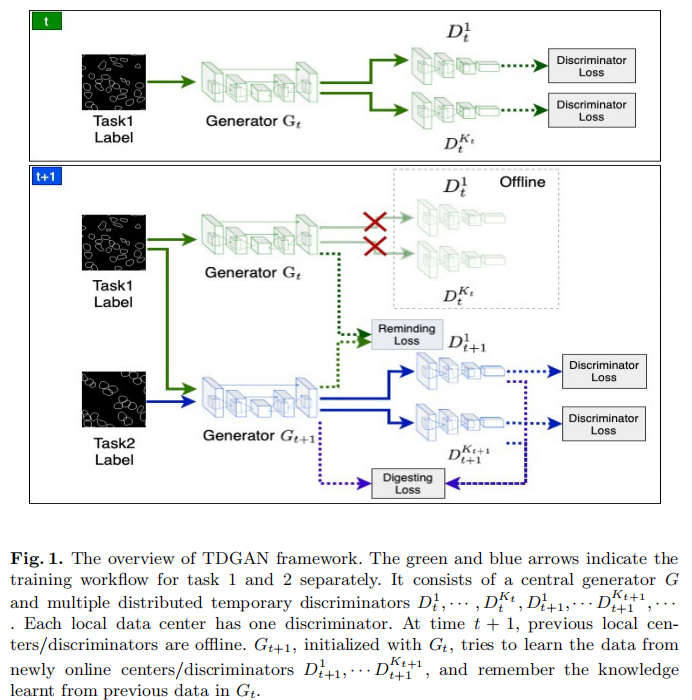

# TDGAN: Learn distributed GAN with Temporary Discriminators

## Description
This repository contains the Pytorch code for the paper:

Learn distributed GAN with Temporary Discriminators, ECCV2020. ([PDF](https://arxiv.org/pdf/2007.09221.pdf))

[Hui Qu<sup>1*</sup>](https://github.com/huiqu18), [Yikai Zhang<sup>1*</sup>](https://github.com/hazaiisme), 
[Qi Chang<sup>1*</sup>](https://github.com/tommy-qichang), Zhennan Yan<sup>2</sup>,
Chao Chen<sup>3</sup>, and Dimitris Metaxas<sup>1</sup>
{hq43,yz422,qc58,dnm}@cs.rutgers.edu, yanzhennan@sensetime.com, chao.chen.cchen@gmail.com. 


## Introduction

In this work, we propose a method for training distributed GAN with sequential temporary discriminators. 
Our proposed method tackles the challenge of training GAN in the federated learning manner: How to update 
the generator with a flow of temporary discriminators? We apply our proposed method to learn a self-adaptive 
generator with a series of local discriminators from multiple data centers. We show our design of loss 
function indeed learns the correct distribution with provable guarantees. Our empirical experiments show 
that our approach is capable of generating synthetic data which is practical for real-world applications 
such as training a segmentation model.




## Dependencies

Pytorch 1.0.0

vidom 0.1.8.9


## Usage

* Use code in under *./data/preprocess* to build training datasets
* Run the scripts under *./scripts* for training and test

## Citation
If you find this code helpful, please cite our work:

```
@artcle{Qu2020learn,
    author = "Qu, Hui and Zhang, Yikai and Chang, Qi and Yan, Zhennan and Chen, Chao and Metaxas, Dimitris",
    title = "Learn distributed GAN with Temporary Discriminators",
    journal = "Proceedings of the European Conference on Computer Vision (ECCV)",
    year = "2020",
}
```

## Acknowledgments
Our code borrows heavily from the the pix2pix implementation [pytorch-CycleGAN-and-pix2pix](https://github.com/junyanz/pytorch-CycleGAN-and-pix2pix).